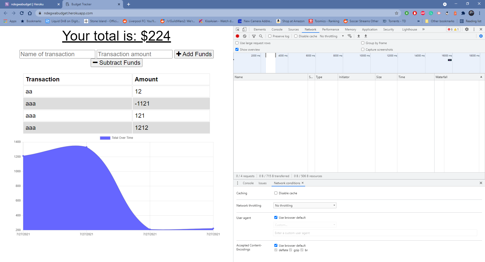
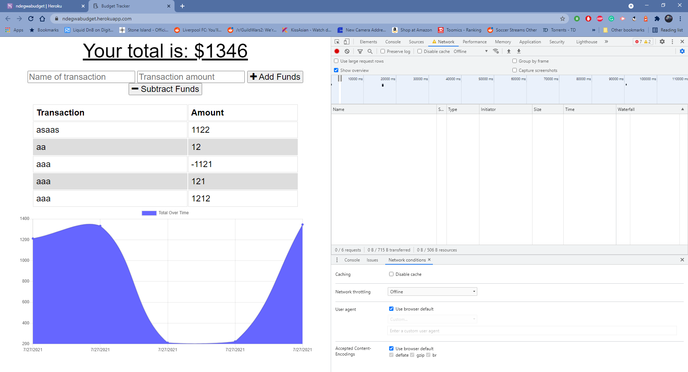

# budget-tracker
MIT 

## Description
  the user is able to add expenses and deposits to there personal budget. this application
 allows the user to still input there transaction offline if there is no stable internet nearby. 
 when the user comes back online all the offline information will be added to tracker. 
  
  ## Table of contents
  - [Description](#description)
  - [Table of contents](#table-of-contents)
  - [Images](#image)
  - [License](#license)
  - [Contributing](#contributing)
  - [Questions](#questions)

## Images 
budget tracker Pictures: 

## Youtube 

# Technologies 
 - compression
 - express
 - lite-server
 - mongoose
 - morgan

## License MIT
I have used a mit License for this application, please see repository for documentation <https://github.com/anthony9292/Team-Generator-/blob/main/License.md>

## Contributing
   anthony9292

## Questions
For questions regarding this application please contact me at:
- E-mail anthon.n08@gmail.com 
- Github:<https://github.com/anthony9292>

    
